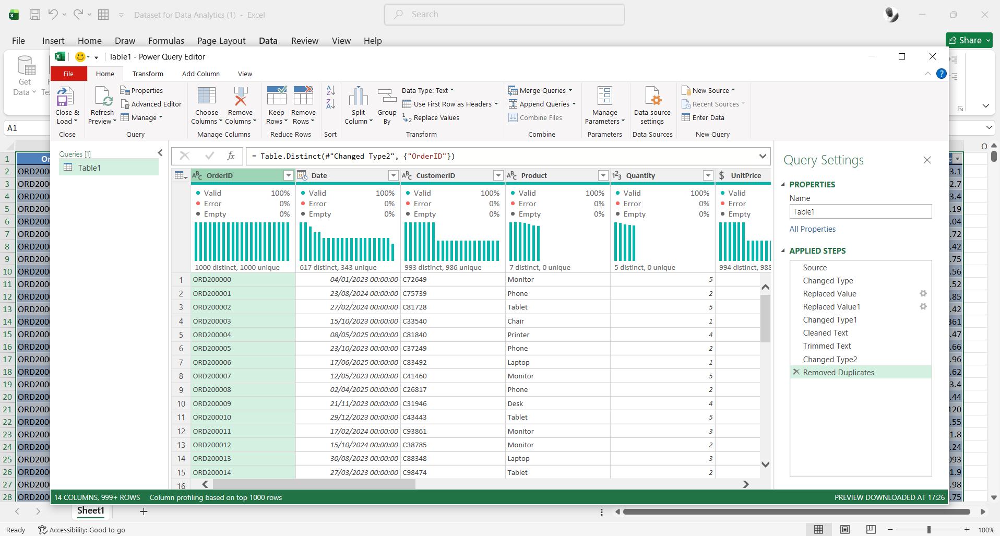
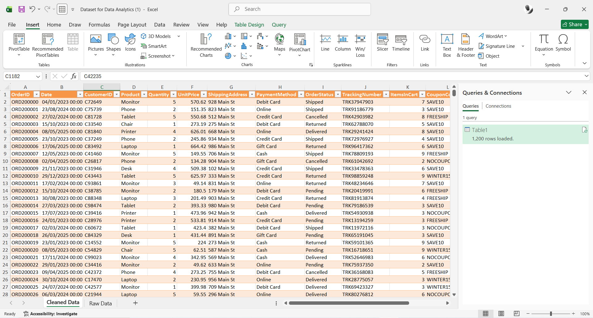

# Project 1: Data Cleaning & Preparation

**Tools:** Microsoft Excel, Power Query
**Dataset:** E-Commerce Sales Dataset (1,200 orders, 14 columns)

## Goal

Audit a raw e-commerce sales dataset for data quality issues and prepare it for time-based analysis.

## What I Found

- Dataset was largely clean on import: no duplicate rows, no duplicate Order IDs, correct data types for Date, Quantity, and Price fields.
- The one significant issue: **CouponCode was missing on 309 of 1,200 orders (25.75%)** — left blank rather than explicitly marked.

## What I Did

1. Audited the dataset for duplicates, missing values, and data type mismatches across all 14 columns
1. Replaced 309 blank CouponCode values with “NOCOUPONCODE” so the field could be used reliably in grouping and filtering
1. Extracted Day, Month, and Year into separate columns from the Date field, expanding the dataset to 17 columns — enabling time-intelligence analysis in Project 2

## Before / After

|                         |Before      |After|
|-------------------------|------------|-----|
|Rows                     |1,200       |1,200|
|Columns                  |14          |17   |
|Missing CouponCode values|309 (25.75%)|0    |

## Outcome

The dataset’s CouponCode field went from 25.75% blank to fully populated, and new Day/Month/Year fields were added — turning a usable-but-incomplete dataset into one ready for the exploratory analysis and time-based trends covered in Project 2.

## Files

- `E-Commerce Sales Data1.xlsx` (Raw Data, CleanedData)
- Cleaned-data-view.png
Power-query-steps.png
