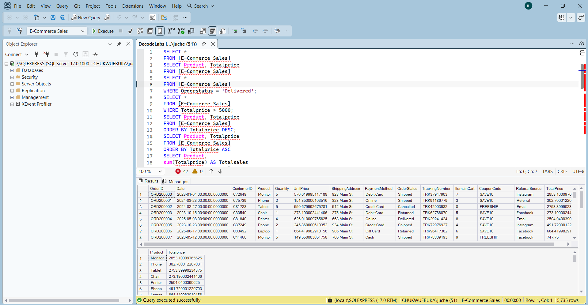
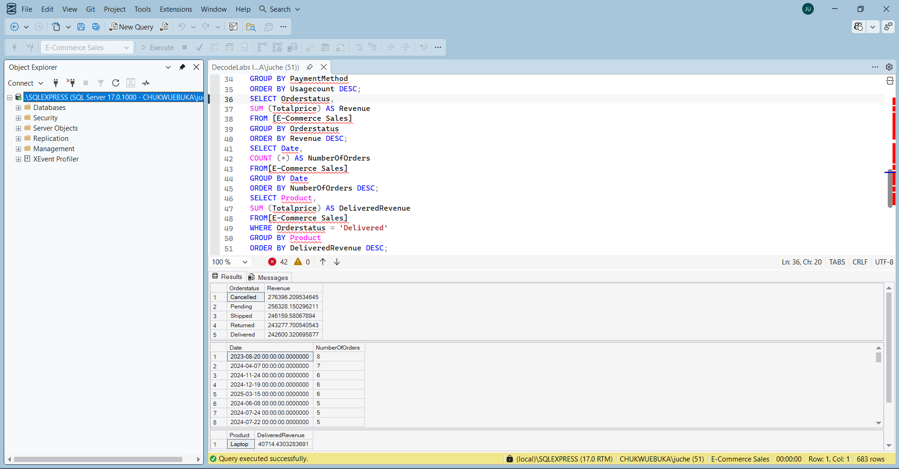

# Project 3: SQL Data Analysis

**Tools:** Microsoft SQL Server, SQL Server Management Studio (SSMS)
**Dataset:** Cleaned E-Commerce Sales Dataset, imported as `[E-Commerce Sales]` (1,200 orders, 17 columns)

## Goal

Use SQL to query, filter, sort, and aggregate the dataset to extract business insights — covering SELECT, WHERE, ORDER BY, GROUP BY, and aggregate functions (COUNT, SUM, AVG).

## What I Did

1. Viewed and filtered raw data using `SELECT` and `WHERE` (e.g. filtering Delivered orders, orders over $5,000)
1. Sorted records by TotalPrice using `ORDER BY` (ascending and descending)
1. Aggregated revenue and quantity by Product using `GROUP BY` with `SUM`
1. Calculated overall metrics with `COUNT` and `AVG`
1. Analyzed payment method usage, order status revenue, and order volume by date
1. Combined `WHERE` + `GROUP BY` to find revenue from Delivered orders only, by product

## Queries

```sql
-- View all records
SELECT * FROM [E-Commerce Sales];

-- Filter: Delivered orders only
SELECT * FROM [E-Commerce Sales]
WHERE Orderstatus = 'Delivered';

-- Filter: high-value orders
SELECT * FROM [E-Commerce Sales]
WHERE Totalprice > 5000;

-- Sort by TotalPrice
SELECT Product, Totalprice FROM [E-Commerce Sales]
ORDER BY Totalprice DESC;

-- Total sales by product
SELECT Product, SUM(Totalprice) AS Totalsales
FROM [E-Commerce Sales]
GROUP BY Product
ORDER BY Totalsales DESC;

-- Overall order count and average order value
SELECT COUNT(*) AS Totalorders FROM [E-Commerce Sales];
SELECT AVG(Totalprice) AS AverageOrderValue FROM [E-Commerce Sales];

-- Total quantity sold by product
SELECT Product, SUM(Quantity) AS TotalQuantitySold
FROM [E-Commerce Sales]
GROUP BY Product
ORDER BY TotalQuantitySold DESC;

-- Payment method usage
SELECT PaymentMethod, COUNT(*) AS UsageCount
FROM [E-Commerce Sales]
GROUP BY PaymentMethod
ORDER BY UsageCount DESC;

-- Revenue by order status
SELECT Orderstatus, SUM(Totalprice) AS Revenue
FROM [E-Commerce Sales]
GROUP BY Orderstatus
ORDER BY Revenue DESC;

-- Revenue from Delivered orders, by product
SELECT Product, SUM(Totalprice) AS DeliveredRevenue
FROM [E-Commerce Sales]
WHERE Orderstatus = 'Delivered'
GROUP BY Product
ORDER BY DeliveredRevenue DESC;
```

## Key Findings

|Metric                      |Value                         |
|----------------------------|------------------------------|
|Total Orders                |[run COUNT query]             |
|Average Order Value         |[run AVG query]               |
|Top product by total sales  |[from GROUP BY Product result]|
|Most-used payment method    |[from PaymentMethod result]   |
|Highest-revenue order status|[from Orderstatus result]     |







## Outcome

SQL queries successfully extracted order-level, product-level, and payment-level insights from the dataset, demonstrating filtering, sorting, aggregation, and conditional grouping — the same analytical questions explored in Projects 1 and 2, now answered directly from the database.

## Files

- `E-Commerce Sales Data.sql`
- ⁠E-Commerce Sales DB1.png
- ⁠E-Commerce Sales DB2.png
