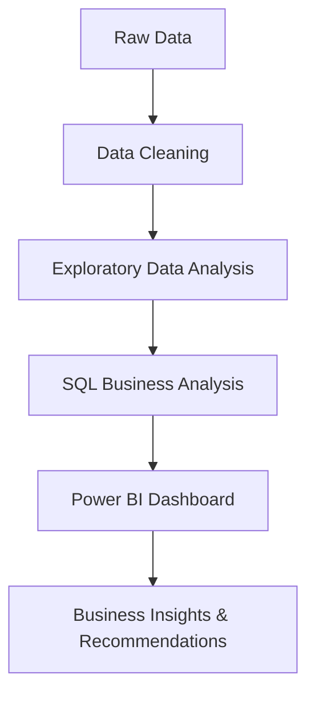

# DecodeLabs Internship 

This repository documents an end-to-end e-commerce data analytics workflow completed during my DecodeLabs internship, covering data cleaning, exploratory data analysis (EDA), SQL analysis, and interactive dashboard development in Power BI

## Analytics Workflow

## Projects

1. *[Project 1: Data Cleaning & Preparation](./Project%201%3A%20Data%20Cleaning)*  — Excel & Power Query
  Audited and cleaned a 1,200 e-commerce dataset by resolving missing CouponCode values, correcting data quality issues, and preparing the data for downstream analysis.

1. *[Project 2: Exploratory Data Analysis (EDA)](./Project%202%3A%20Exploratory%20Data%20Analysis%20(EDA))* — Excel, Pivot Tables, Descriptive Statistics
   Performed exploratory data analysis (EDA) using Excel Pivot Tables and descriptive statistics to identify sales trends, order value distribution, customer behavior, and product performance.

   
1. *[Project 3: SQL Data Analysis](./Project%203%3A%20SQL%20Data%20Analysis)*  — Microsoft SQL Server, SSMS
  Used SQL to answer business questions related to customer purchasing behavior, product performance, payment methods, and order fulfillment with SQL queries (SELECT, WHERE, ORDER BY, GROUP BY, aggregates) to extract order-level, product-level, and payment-level insights.

1. *[Project 4: Data Visualization](./Project%204%3A%20Data%20Visualization)* — Power BI, DAX
   Built an interactive dashboard surfacing key business insights, including highlighting operational challenges, including high cancellation and return rates alongside low customer retention.

   
## Dataset

All projects use the same E-Commerce Sales Dataset (1,200 orders, Jan 2023 – Jun 2025), cleaned and progressively enriched across Projects 1–4.

## Tools

Microsoft Excel, Power Query, Microsoft SQL Server, SQL Server Management Studio (SSMS), Power BI, DAX

## Author

Jeremiah Uchechukwu
Data Analytics Intern | Power BI | SQL | Excel
[LinkedIn](https://www.linkedin.com/in/jeremiah-uchechukwu-7aba073a6)
